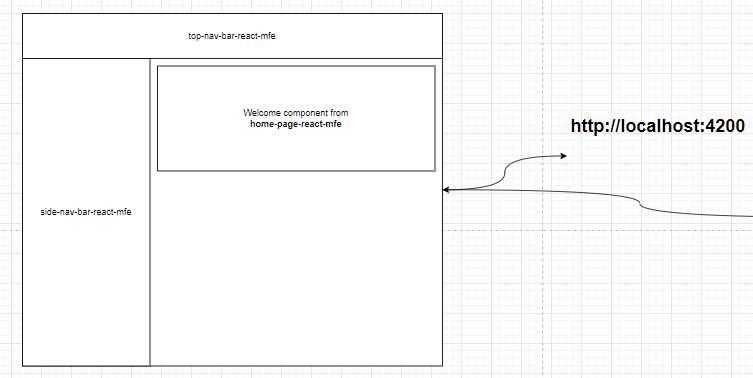

# MfePoc

Some proof-of-concepts that were run in this repo:

- Shell SHOULD render home-page-mfe (in react) ✅
- home-page-mfe SHOULD check its mock-authentication: ✅
    - if authenticated. stay on home-page-mfe
    - if NOT authenticated. then navigate to sign-in-page
- Plugins’ styles should be encapsulated ⏳
- home-page-mfe SHOULD load other MFEs
    - host React MFE ✅
    - host Angular MFE  ✅
    - React MFE SHOULD be able to invoke modal ✅
    - React MFE SHOULD be able to invoke Drawer ✅
    - Angular MFE SHOULD be able to invoke modal ✅
    - Angular MFE SHOULD be able to invoke Drawer
    - Routing SHOULD be invocable from 1 MFE and be reflected in another ✅
        
   
Good to have:
- Share singleton service among all MFEs
    - using "window" variable ✅
    - using reactive lib ⏳
- Inject a WebComponent from 1 MFE to another MFE dynamically. ⏳

> ❗ At the moment, this POC fails if two Angular MFE are run in the **home-page-react-mfe**. Comment out one to see the other running.
